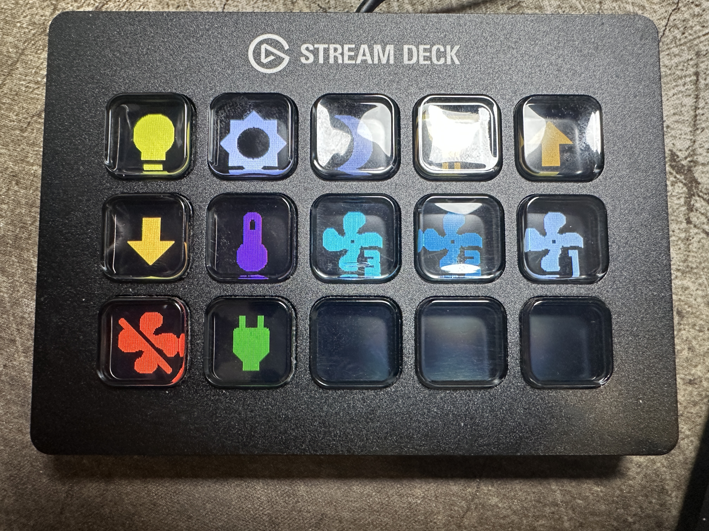

# Streamdeck MQTT

> **Fork note:** This is a fork of [LukasOchmann/streamdeck-mqtt](https://github.com/LukasOchmann/streamdeck-mqtt) with native (Docker-free) installation support for Raspberry Pi Zero W (ARMv6) and a pre-configured Home Assistant office control layout. See [NATIVE_INSTALL.md](NATIVE_INSTALL.md) for the non-Docker setup guide.

A Stream Deck to Home Assistant bridge via MQTT. It is using this [library](https://github.com/abcminiuser/python-elgato-streamdeck#python-elgato-stream-deck-library).

## What this fork changes

| Area | Original | This fork |
|------|----------|-----------|
| Installation | Docker only | Docker + native install on Pi Zero W (ARMv6) |
| `main.py` | Queries deck before `deck.open()` | Calls `deck.open()` immediately after enumeration |
| `StreamDeckMQTT.py` | Calls `self.deck.open()` again inside `init()` | Removed duplicate open (deck is already open) |
| HIDAPI backend | Assumes libusb | Supports hidraw backend (required on Pi Zero W) |
| Key layout | Empty by default | Pre-configured 12-key office control layout |
| HA automations | None included | 12 MQTT-triggered automations for office devices |

## My Key Layout (Elgato Stream Deck Original, 15 keys)



```
┌─────────────┬─────────────┬─────────────┬─────────────┬─────────────┐
│ 0: Office   │ 1: Office   │ 2: Office   │ 3: Key Light│ 4: Key Light│
│ Light ⚡    │ Bright +    │ Bright -    │ Toggle 💡   │ Bright +    │
├─────────────┼─────────────┼─────────────┼─────────────┼─────────────┤
│ 5: Key Light│ 6: Key Light│ 7: Fan      │ 8: Fan      │ 9: Fan      │
│ Bright -    │ Temp 🌡️     │ HIGH        │ MEDIUM      │ LOW         │
├─────────────┼─────────────┼─────────────┼─────────────┼─────────────┤
│10: Fan      │11: Outlet   │12:          │13:          │14:          │
│ OFF         │ Toggle      │ (empty)     │ (empty)     │ (empty)     │
└─────────────┴─────────────┴─────────────┴─────────────┴─────────────┘
```

### Key Actions

| Key | Icon | Action |
|-----|------|--------|
| 0 | `mdi:ceiling-light` (yellow) | Toggle office ceiling light (Inovelli dimmer) |
| 1 | `mdi:brightness-5` (white) | Office light brightness +25% |
| 2 | `mdi:brightness-3` (gray) | Office light brightness -25% |
| 3 | `mdi:lightbulb-spot` (orange) | Toggle Elgato Key Light |
| 4 | `mdi:arrow-up-bold` (orange) | Key Light brightness +25% |
| 5 | `mdi:arrow-down-bold` (orange) | Key Light brightness -25% |
| 6 | `mdi:thermometer` (purple) | Cycle Key Light color temp (3000K → 4500K → 6500K) |
| 7 | `mdi:fan-speed-3` (cyan) | Office fan HIGH (99%) |
| 8 | `mdi:fan-speed-2` (teal) | Office fan MEDIUM (66%) |
| 9 | `mdi:fan-speed-1` (lightblue) | Office fan LOW (33%) |
| 10 | `mdi:fan-off` (red) | Office fan OFF |
| 11 | `mdi:power-plug` (green) | Toggle office outlet |

### Home Assistant Automations

The following automations are created in HA to listen for MQTT messages from the Stream Deck and control the corresponding entities:

| Automation | MQTT Topic | HA Entity |
|------------|-----------|-----------|
| StreamDeck - Office Light Toggle | `streamdeck/0` | `light.office_office_celling_light` |
| StreamDeck - Office Light Brightness Up | `streamdeck/1` | `light.office_office_celling_light` |
| StreamDeck - Office Light Brightness Down | `streamdeck/2` | `light.office_office_celling_light` |
| StreamDeck - Key Light Toggle | `streamdeck/3` | `light.elgato_bw36j1a00874` |
| StreamDeck - Key Light Brightness Up | `streamdeck/4` | `light.elgato_bw36j1a00874` |
| StreamDeck - Key Light Brightness Down | `streamdeck/5` | `light.elgato_bw36j1a00874` |
| StreamDeck - Key Light Color Temp Cycle | `streamdeck/6` | `light.elgato_bw36j1a00874` + `input_select.key_light_color_temp` |
| StreamDeck - Office Fan High | `streamdeck/7` | `fan.office_office_fan` |
| StreamDeck - Office Fan Medium | `streamdeck/8` | `fan.office_office_fan` |
| StreamDeck - Office Fan Low | `streamdeck/9` | `fan.office_office_fan` |
| StreamDeck - Office Fan Off | `streamdeck/10` | `fan.office_office_fan` |
| StreamDeck - Office Outlet Toggle | `streamdeck/11` | `switch.office_office_outlet` |

### HA Helpers Required

| Helper | Type | Purpose |
|--------|------|---------|
| `input_select.key_light_color_temp` | Input Select (3000, 4500, 6500) | Tracks color temp cycle state for Key Light |

### Notes

- The Inovelli dimmer must be in **Dimmer mode** (not On/Off mode) for brightness controls to work. Check `select.office_office_celling_light_dimmer_mode` in HA.
- The color temp cycle button rotates through warm (3000K) → neutral (4500K) → cool (6500K) on each press.
- The office fan uses percentage-based speed: 33% (low), 66% (medium), 99% (high).


## Hardware

| Part | Notes |
| --- | --- |
| Elgato Stream Deck | Original, Original V2, MK.2, Mini, Mini MK.2, XL, XL V2, Neo, Plus and Pedal are supported by the underlying [python-elgato-streamdeck](https://github.com/abcminiuser/python-elgato-streamdeck) library |
| Raspberry Pi Zero W | Original Pi Zero / Zero W (ARMv6). This fork exists because the original Docker images don't support ARMv6 |
| microSD card | 8 GB or more, for Raspberry Pi OS Lite |
| Power supply | The official supply for your Pi model |
| USB OTG adapter | micro-USB (male) to USB-A (female), plugged into the **middle** port labelled `USB`, not the one labelled `PWR` |
| Powered USB hub | Recommended. The Stream Deck draws more current than the Pi Zero can reliably provide — if the deck resets or is not detected, a powered hub fixes it |

> **Want Docker instead?** If you're running a Pi 3/4/5 or Pi Zero 2 W, the original repo has pre-built Docker images that work out of the box. See [LukasOchmann/streamdeck-mqtt](https://github.com/LukasOchmann/streamdeck-mqtt) for the Docker setup.

## Installation (Native, Pi Zero W)

### 1. Flash the OS

Use the [Raspberry Pi Imager](https://www.raspberrypi.com/software/) and pick
**Raspberry Pi OS Lite (32-bit)**. In the settings dialog configure:

- hostname (e.g. `streamdeck`)
- username and password
- Wi-Fi SSID and password — the Pi Zero W only supports **2.4 GHz** networks
- enable SSH

Write the card, plug in the Stream Deck via the OTG adapter (or powered hub), and power up.

### 2. Install system dependencies

```sh
sudo apt update
sudo apt install -y git python3 python3-venv python3-dev build-essential pkg-config \
  libcairo2-dev libhidapi-hidraw0 libhidapi-libusb0 libhidapi-dev \
  libusb-1.0-0-dev libffi-dev libjpeg-dev zlib1g-dev \
  libfreetype6-dev liblcms2-dev libopenjp2-7-dev libtiff-dev
```

### 3. Fix HIDAPI backend

The Pi Zero W needs the hidraw backend symlinked in place of libusb:

```sh
sudo ln -sf libhidapi-hidraw.so.0.0.0 /usr/lib/arm-linux-gnueabihf/libhidapi-libusb.so.0
sudo ln -sf libhidapi-hidraw.so.0.0.0 /usr/lib/arm-linux-gnueabihf/libhidapi-libusb.so
sudo ldconfig
```

### 4. Udev rules

Create `/etc/udev/rules.d/99-streamdeck.rules`:

```
SUBSYSTEM=="usb", ATTRS{idVendor}=="0fd9", MODE="0666"
KERNEL=="hidraw*", ATTRS{idVendor}=="0fd9", MODE="0666"
```

Then reload:

```sh
sudo udevadm control --reload-rules
sudo udevadm trigger
```

Unplug and replug the Stream Deck after this step.

### 5. Clone and install

```sh
cd ~
git clone https://github.com/slientnight/streamdeck-mqtt.git
cd streamdeck-mqtt
python3 -m venv .venv
./.venv/bin/python -m pip install --upgrade pip setuptools wheel
./.venv/bin/python -m pip install --prefer-binary -r requirements.txt
```

### 6. Configure

Create `.env`:

```
MQTT_HOST=192.168.1.50
MQTT_PORT=1883
MQTT_USER=your-mqtt-user
MQTT_PASS=your-mqtt-password
```

Create `data.json`:

```json
{"brightness":60,"keys":[]}
```

### 7. Test

```sh
./.venv/bin/python src/main.py
```

The log prints the deck type, key count, and serial number — you need the serial number to address the deck individually via MQTT.

### 8. Systemd service (auto-start on boot)

Create `/etc/systemd/system/streamdeck-mqtt.service`:

```ini
[Unit]
Description=Stream Deck MQTT bridge
Wants=network-online.target
After=network-online.target

[Service]
Type=simple
User=<your-user>
WorkingDirectory=/home/<your-user>/streamdeck-mqtt
ExecStart=/home/<your-user>/streamdeck-mqtt/.venv/bin/python src/main.py
Environment=PYTHONUNBUFFERED=1
Restart=on-failure
RestartSec=10

[Install]
WantedBy=multi-user.target
```

Then enable:

```sh
sudo systemctl daemon-reload
sudo systemctl enable --now streamdeck-mqtt
```


## Data.json

| key | type |  | description |
| --- | --- | --- | --- |
| brightness | number[0 - 100] | required | The brightness that should be displayed |
| keys | array | required | Configuration per key |


### keys

| key | type | | description |
| ---| --- |  --- | --- |
| type | enum("icon") | required | currently unused, but required to be "icon" |
| icon | string | required | a mdi string from home assistant like mdi:lightbulb or actual svg content |
| color | hex color or color name | optional | that color will be set to fill the mdi icon or svg. Defaults to "blue" |

## MQTT settings

To Configure the MQTT-Client there are Environment Variables.

|name||Description|
| --- | --- | --- |
| MQTT_HOST | required | the host address of what MQTT Broker you will use |
| MQTT_PORT| optional; default 1883 | If you do different port then 1883 u can use this to change it |
| MQTT_USER | required | The user-name that is registered at the broker |
| MQTT_PASS | optional (i guess) | You can omit the password if you have an unsecured broker |

## Topics

### Subscribe

The service subscribes the main topic `streamdeck/` and `streamdeck/<serialNumber>/`.
If you want to run multiple instances you should send the versions with <serialNumber>.

#### `streamdeck/brightness` & `streamdeck/<serialNumber>/brightness`

It updates the brightness. Valid are values between 0 and 100 where 0 means off and 100 means full brightness.
Payload type Int.

The value will be persisted in the `data.json`.

#### `streamdeck/sleep` & `streamdeck/<serialNumber>/sleep`

Just a shortcut to set the brightness to 0.

#### `streamdeck/wake` & `streamdeck/<serialNumber>/wake`

Sets the brightness to the last set brightness from the `data.json`.

#### `streamdeck/config` & `streamdeck/<serialNumber>/config`

Will override all keys. The payload has the same Schema as the Keys in the `data.json`.

#### `streamdeck/config/<keyIdx>` & `streamdeck/<serialNumber>/config/<keyIdx>`

It updates the one key by the index. Please see the key-schema.

### Publish

Every key-press will publish the following Topics

Use
`streamdeck/<key>` or 
`streamdeck/<key>/<serialNumber>`
for regular button push events.

If you want to use keys as a e.g. dimmer you can listen to
`streamdeck/<key>/down`
`streamdeck/<key>/<serialNumber>/down`
and
`streamdeck/<key>/up`
`streamdeck/<key>/<serialNumber>/up`


